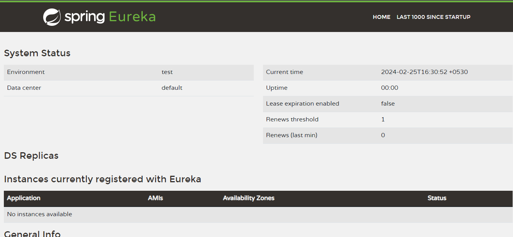
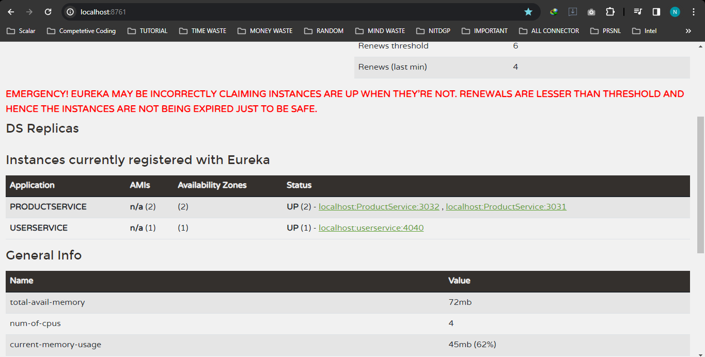

Steps for Setup Eureka Service Discovery Server
1. create a spring boot fresh project
2. install the Eureka dependency in pom.xml 
3. https://mvnrepository.com/artifact/org.springframework.cloud/spring-cloud-starter-netflix-eureka-server/4.1.0
         <!-- https://mvnrepository.com/artifact/org.springframework.cloud/spring-cloud-starter-netflix-eureka-server -->
        <dependency>
            <groupId>org.springframework.cloud</groupId>
            <artifactId>spring-cloud-starter-netflix-eureka-server</artifactId>
            <version>4.1.0</version>
        </dependency>

4. now set up the below property in the application.property file
5.  
    server.port=8761
    eureka.client.register-with-eureka=false #As this Act as server so it is not be a client , other microservices are act as client
    eureka.client.fetch-registry=false

6. now add @EnableEurekaServer in Application class and run and then go to local server you will able to see
http://localhost:8761/
7. 
8. 

